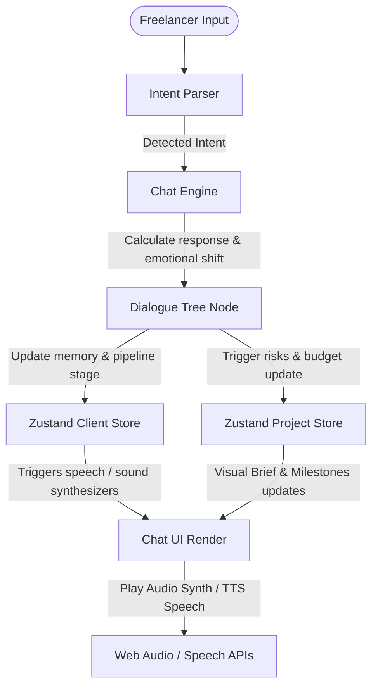

# Faclie — Next-Gen Freelance Client Simulator

[](https://nextjs.org)
[](https://tailwindcss.com)
[](https://react.dev)
[](https://github.com/pmndrs/zustand)
[](https://www.framer.com/motion/)
[](https://developer.mozilla.org/en-US/docs/Web/API/Web_Audio_API)
[](https://developer.mozilla.org/en-US/docs/Web/API/Web_Speech_API)

**Faclie** (Freelance Client Simulator) adalah platform simulasi percakapan interaktif berbasis web untuk melatih kemampuan negosiasi, manajemen *scope creep*, dan penanganan *red flags* klien. Dirancang menyerupai realita dunia freelance agensi, platform ini menyimulasikan emosi klien yang dinamis, kejadian krisis tak terduga (*surprise events*), serta memberikan rapor evaluasi performa di akhir sesi.

---

## 🌟 Fitur Unggulan

### 1. Hybrid Dialogue Engine & Intent Parsing
Simulator mendeteksi intensitas, penawaran harga, penolakan, atau persetujuan secara dinamis berdasarkan input freelancer. Klien akan merespons menggunakan state emosional (*Satisfaction*, *Patience*, *Urgency*) dan sistem memori jangka pendek/panjang.

### 2. Real-Time Diagnostic Meters
Status emosional klien ditampilkan secara real-time:
- **Satisfaction**: Kepuasan klien terhadap output dan komunikasi Anda.
- **Patience**: Batas kesabaran klien sebelum mereka membatalkan proyek.
- **Urgency**: Tingkat kepanikan tenggat waktu klien.

### 3. Advanced Features (Native APIs)
- 🎵 **Synthesized Sound Effects (Web Audio API)**: Sound effect interaktif yang disintesis secara dinamis langsung di browser (suara ketikan, chime notifikasi masuk, alarm sirine darurat saat krisis, dan melodi kemenangan saat proyek sukses). Tanpa perlu mengunduh file suara tambahan.
- 🗣️ **Text-To-Speech Voice Notes (Web Speech API)**: Klien dapat mengirimkan *voice notes* transkrip yang bisa dibacakan langsung menggunakan suara sintesis bahasa Inggris, Indonesia, atau campuran, lengkap dengan penyesuaian nada (*pitch*) dan kecepatan (*rate*) berdasarkan tingkat emosi klien.
- 🛠️ **Custom Client Creator**: Buat klien impian (atau terburuk) Anda sendiri dengan form interaktif glassmorphic. Tentukan traits psikologis mereka menggunakan slider (Agreeableness, Neuroticism, dll.), atur bahasa komunikasi, tingkat kesulitan, serta red flags dan quirks khusus mereka.

### 4. Interactive Project Specification & Milestone Tracker
Sidebar proyek akan memantau perubahan kontrak, anggaran (*budget*), *risk indicators* (seperti *Mid-Project Scope Creep* atau *Severe Payment Delay*), serta pembayaran dari setiap tonggak pencapaian (*milestones*).

### 5. Performance Report Card & PDF Log Exporter
Dapatkan penilaian terperinci mengenai *Professionalism*, *Scope Management*, dan *Negotiation Skill* saat simulasi selesai. Freelancer dapat mengekspor log obrolan lengkap beserta rapor penilaian ke format PDF untuk evaluasi lanjutan.

---

## 📐 Arsitektur Sistem

Alur kerja simulator dirancang modular dengan memisahkan state manajemen, engine dialog, dan antarmuka visual:



---

## 📂 Struktur Folder Proyek

```bash
faclie/
├── public/                 # Static assets (custom SVG avatars & logo)
│   ├── logo.svg            # Logo aplikasi custom
│   └── avatars/            # Custom SVG avatar untuk 8 klien persona + difficulty placeholders
├── src/
│   ├── app/                # Next.js App Router Pages
│   │   ├── analytics/      # Halaman rapor analisis performa & tonton ulang chat
│   │   ├── dashboard/      # Dashboard manajemen proyek & pipeline board
│   │   └── simulator/      # Ruang simulasi chat interaktif
│   ├── components/         # Reusable UI & Layout components (Dialog, Button, dll)
│   ├── features/           # Modular feature components
│   │   ├── chat/           # Chat window, Message bubble, Typing indicator
│   │   ├── clients/        # Personas metadata & Custom Client Creator Modal
│   │   ├── dashboard/      # Pipeline boards & client cards UI
│   │   └── project/        # Sidebar Project Brief Panel
│   ├── services/           # Simulasi Dialog & Intent processing logic
│   │   ├── chatEngine.ts   # Pemrosesan pesan user & trigger transisi state
│   │   ├── dialogTree.ts   # Pohon opsi jawaban klien berdasarkan pipeline & emosi
│   │   └── intentParser.ts # Keyword parser untuk mendeteksi intensi freelancer
│   ├── store/              # Zustand global state (chat, clients, projects)
│   ├── types/              # TypeScript interface definitions
│   └── utils/              # Helper utilities (audio synthesizer, speech, PDF exporter)
│       ├── audioService.ts # Synthesizer Web Audio API
│       ├── speechService.ts# Synthesizer Web Speech TTS
│       └── pdfExporter.ts  # PDF export logic menggunakan jsPDF
```

---

## 🛠️ Panduan Instalasi Lokal

Ikuti langkah-langkah berikut untuk menjalankan proyek di komputer Anda secara lokal:

### Prasyarat
Pastikan Anda sudah menginstal [Node.js](https://nodejs.org) (Versi 18 ke atas direkomendasikan).

### Langkah-langkah
1. **Clone repositori**:
   ```bash
   git clone https://github.com/username/faclie.git
   cd faclie
   ```

2. **Instal dependensi**:
   ```bash
   npm install
   ```

3. **Jalankan server pengembangan**:
   ```bash
   npm run dev
   ```

4. **Buka browser**:
   Akses [http://localhost:3000](http://localhost:3000) (atau port lain yang ditunjuk) untuk melihat aplikasi berjalan secara lokal.

---

## 🧪 Validasi Build & Linting

Sebelum melakukan push commits ke GitHub, pastikan kode lulus pemeriksaan berikut:

- **Build check**:
  ```bash
  npm run build
  ```
- **Linter check**:
  ```bash
  npm run lint
  ```

---

## 📄 Lisensi
Proyek ini dilisensikan di bawah lisensi MIT. Silakan gunakan dan kembangkan secara bebas untuk melatih talenta freelance agensi profesional.
