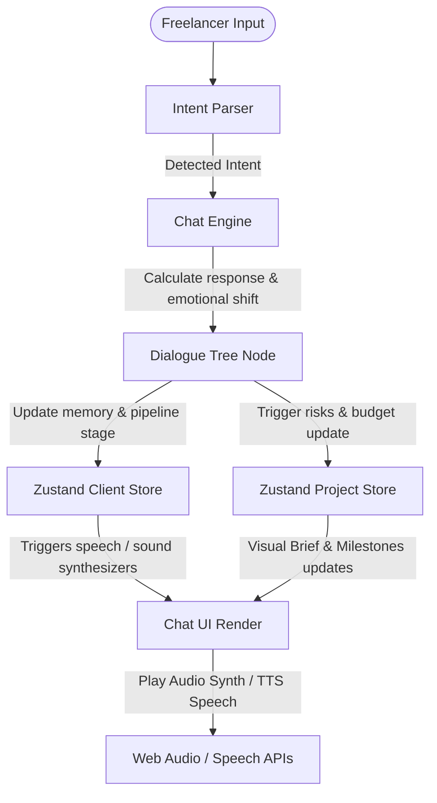

# Project Architecture - Faclie Client Simulator

Faclie is structured as a modular Next.js application that separates state management, dialogue computation, and local browser synthesizers.

## Overview Flow

The user interacts through the Chat UI. Each message goes through the Intent Parser. The parsed intent is sent to the Chat Engine, which fetches a response from either the NVIDIA AI Completion Route or falls back to the offline Dialogue Tree. The store updates client emotion states and project milestones, which dynamically trigger visual updates, audio chimes, and speech synthesis:

## Core Modules

### 1. State Management (Zustand)
-   **Client Store** ([useClientStore.ts](file:///d:/Project/Faclie.com/src/store/useClientStore.ts)): Manages the active states of all client profiles, including current satisfaction, patience, urgency, active moods, pipeline stages, and short-term dialogue memory.
-   **Project Store** ([useProjectStore.ts](file:///d:/Project/Faclie.com/src/store/useProjectStore.ts)): Tracks project specifications, deliverables, budget changes, milestone progress, and risk indicators.
-   **Chat Store** ([useChatStore.ts](file:///d:/Project/Faclie.com/src/store/useChatStore.ts)): Caches the chat history logs, typing indicators, sound configurations, and scorecard evaluations.

### 2. Dialogue & Parsing Services
-   **Chat Engine** ([chatEngine.ts](file:///d:/Project/Faclie.com/src/services/chatEngine.ts)): Coordinates incoming inputs, sanitizes strings, fetches response packets, updates store values, and delivers messages with typing delays.
-   **Intent Parser** ([intentParser.ts](file:///d:/Project/Faclie.com/src/services/intentParser.ts)): Analyzes user text for specific negotiation keywords (e.g. "out of scope", "budget", "deposit") to flag intents.
-   **Dialogue Tree** ([dialogTree.ts](file:///d:/Project/Faclie.com/src/services/dialogTree.ts)): Defines the offline structural nodes and fallback dialogues for every client persona across project stages.

### 3. Local Native Synthesizers
-   **Web Audio Synth** ([audioService.ts](file:///d:/Project/Faclie.com/src/utils/audioService.ts)): Generates real-time sound effects (clicks, alert rings, victory tunes) directly inside the browser using oscillator nodes, avoiding asset loading latency.
-   **Text-to-Speech** ([speechService.ts](file:///d:/Project/Faclie.com/src/utils/speechService.ts)): Synthesizes voices in English or Indonesian, adapting speaking rates and pitch on the fly to reflect client emotional statuses.
